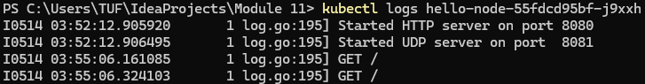
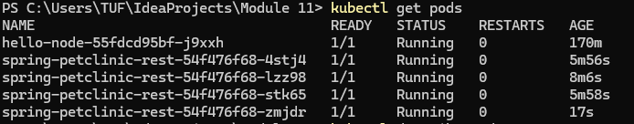
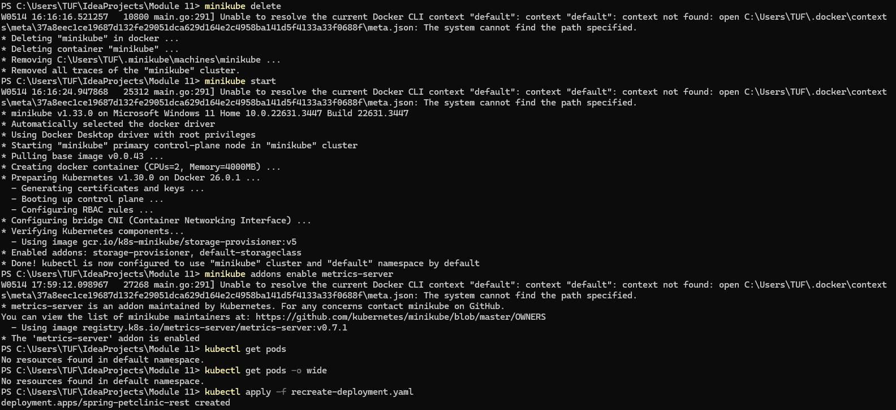
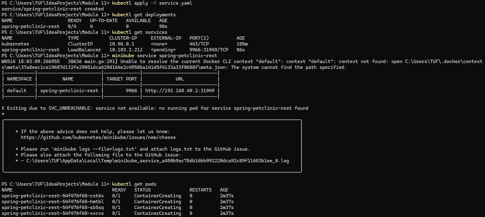
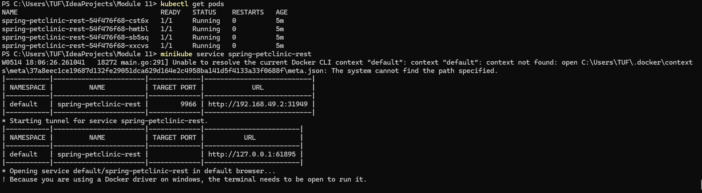
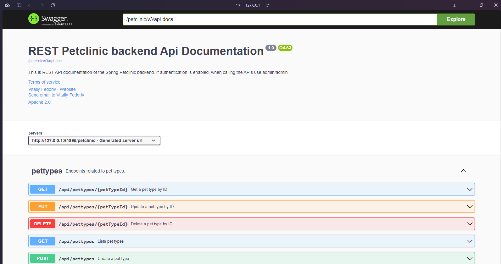

# Module 11 - Deployment on Kubernetes

> ##### Muhammad Daffa Grahito Triharsanto - 2206820075 - Pemrograman Lanjut B

## Hello Minikube

### Reflections
1. ***Compare the application logs before and after you exposed it as a Service. Try to open the app several times while the proxy into the Service is running. What do you see in the logs? Does the number of logs increase each time you open the app?***

    Dari log dapat dipahami bahwa sebelum meng*expose* aplikasinya sebagai service, aplikasinya diakses secara langsung di dalam pod. Log menunjukkan pesan-pesan awal (start server HTTP on port 8080) dan setiap permintaan masuk (GET /). Setiap kali aplikasi di access di dalam pod, dibuat entri log untuk request tersebut. Setelah menjadikan aplikasi sebagai service menggunakan `minikube service hello-node`, log tetap menunjukkan pesan-pesan awal dan permintaan masuk seperti sebelumnya namun sekarang aplikasi diakses melalui service, yang meneruskan traffic ke pod. Mengakses aplikasi melalui service memungkinkan akses eksternal ke aplikasi, sementara mengaksesnya di dalam pod lebih bersifat internal dalam cluster Kubernetes.
    

2. ***Notice that there are two versions of `kubectl get` invocation during this tutorial section. The first does not have any option, while the latter has `-n` option with value set to `kube-system`. What is the purpose of the `-n` option and why did the output not list the pods/services that you explicitly created?***

    Opsi `-n` dalam perintah `kubectl get` digunakan untuk menentukan namespace di mana resource akan ditampilkan. Jika tidak menyertakan opsi `-n`, `kubectl get` akan menampilkan resource dari namespace default. Pada pemanggilan yang kemudian, kubectl get digunakan dengan opsi `-n kube-system`, yang memberitahukannya untuk menampilkan resource dari namespace kube-system secara khusus. Namespace ini berisi system component dan infrastructure dari Kubernetes itu sendiri, seperti layanan inti sistem seperti DNS, server API, dan dashboard Kubernetes.

## Rolling Update & Kubernetes Manifest File

### Reflections
1. ***What is the difference between Rolling Update and Recreate deployment strategy?***

    Perbedaan utama antara strategi Rolling Update dan Recreate Deployment terletak pada downtime yang terjadi selama proses pembaruan aplikasi. Pada Recreate Deployment, terjadi downtime karena semua pod dari versi aplikasi sebelumnya terhenti sebelum pod baru dengan versi terbaru dibuat. Downtime terjadi karena aplikasi tidak tersedia selama periode antara penghapusan pod lama dan pembuatan pod baru. Di sisi lain, Rolling Update menghindari downtime dengan melakukan pembaruan secara bertahap, mempertahankan ketersediaan aplikasi selama proses pembaruan. Pod baru dengan versi terbaru dari aplikasi dibuat satu per satu, sementara pod lama tetap berjalan. Dengan demikian, Rolling Update memastikan aplikasi tetap online tanpa waktu tidak tersedianya selama proses pembaruan.

2. ***Try deploying the Spring Petclinic REST using Recreate deployment strategy and document your attempt.***

    Sebelum memakai Recreate Deployment Strategy:
    

    Untuk mengapply Recreate Deployment Strategy, saya mengapply manifest file dengan strategy type berbeda dan menggunakan manifest file service yang sama dengan tutorial sebelumnya.

    

    

    

    Setelah mengakses endpoint `/petclinic`:
    

3. ***Prepare different manifest files for executing Recreate deployment strategy.***

    Manifest filenya yang saya namakan `recreate-deployment.yaml` saya buat berdasarkan `deployment.yaml` pada tutorial, lalu type strategynya saya ubah menjadi Recreate.
    `recreate-deployment.yaml`:
    ```yaml
    apiVersion: apps/v1
    kind: Deployment
    metadata:
    annotations:
        deployment.kubernetes.io/revision: "4"
    creationTimestamp: "2024-05-14T06:09:33Z"
    generation: 5
    labels:
        app: spring-petclinic-rest
    name: spring-petclinic-rest
    namespace: default
    resourceVersion: "11611"
    uid: 14543249-9677-49c0-9d47-ddcb76cd4558
    spec:
    progressDeadlineSeconds: 600
    replicas: 4
    revisionHistoryLimit: 10
    selector:
        matchLabels:
        app: spring-petclinic-rest
    strategy:
        type: Recreate
    template:
        metadata:
        creationTimestamp: null
        labels:
            app: spring-petclinic-rest
        spec:
        containers:
        - image: docker.io/springcommunity/spring-petclinic-rest:3.2.1
            imagePullPolicy: IfNotPresent
            name: spring-petclinic-rest
            resources: {}
            terminationMessagePath: /dev/termination-log
            terminationMessagePolicy: File
        dnsPolicy: ClusterFirst
        restartPolicy: Always
        schedulerName: default-scheduler
        securityContext: {}
        terminationGracePeriodSeconds: 30
    status:
    availableReplicas: 4
    conditions:
    - lastTransitionTime: "2024-05-14T06:17:13Z"
        lastUpdateTime: "2024-05-14T06:17:13Z"
        message: Deployment has minimum availability.
        reason: MinimumReplicasAvailable
        status: "True"
        type: Available
    - lastTransitionTime: "2024-05-14T06:09:33Z"
        lastUpdateTime: "2024-05-14T06:42:25Z"
        message: ReplicaSet "spring-petclinic-rest-54f476f68" has successfully progressed.
        reason: NewReplicaSetAvailable
        status: "True"
        type: Progressing
    observedGeneration: 5
    readyReplicas: 4
    replicas: 4
    updatedReplicas: 4
    ```

4. ***What do you think are the benefits of using Kubernetes manifest files? Recall your experience in deploying the app manually and compare it to your experience when deploying the same app by applying the manifest files (i.e., invoking `kubectl apply -f` command) to the cluster.***

    Dengan menggunakan manifest files, prosedur deployment menjadi lebih terstandarisasi dan terdokumentasi secara deklaratif yang mengurangi risiko *human-error* karena tidak perlu mengingat prosedur secara spesifik.. Manifest files memungkinkan pengelolaan konfigurasi aplikasi secara efisien, sehingga pengguna tidak perlu khawatir tentang setup manual yang memakan waktu. 

5. ***(Optional) Do the same tutorial steps, but on a managed Kubernetes cluster (e.g., GCP). You need to provision a Kubernetes cluster on Google Cloud Platform. Then, re-run the tutorial steps (Hello Minikube and Rolling Update) on the remote cluster. Document your attempt and highlight the differences and any issues you encountered.***